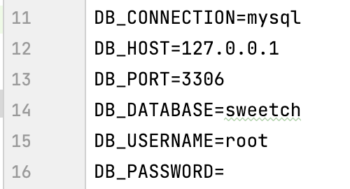
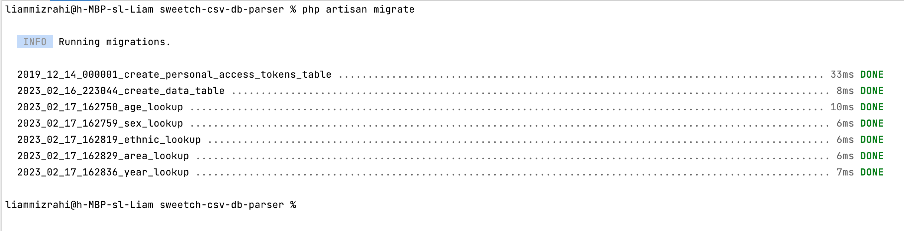
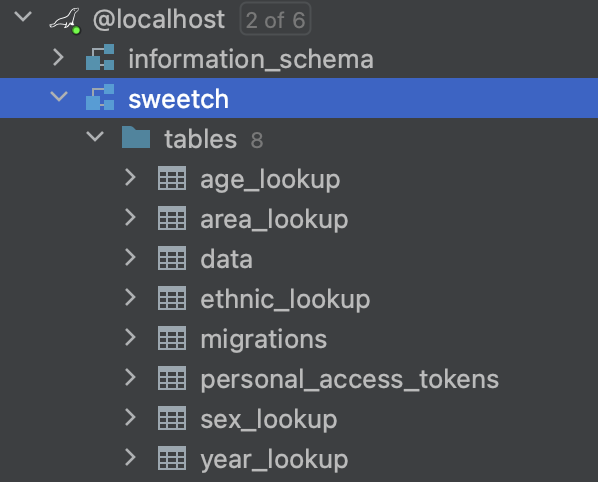
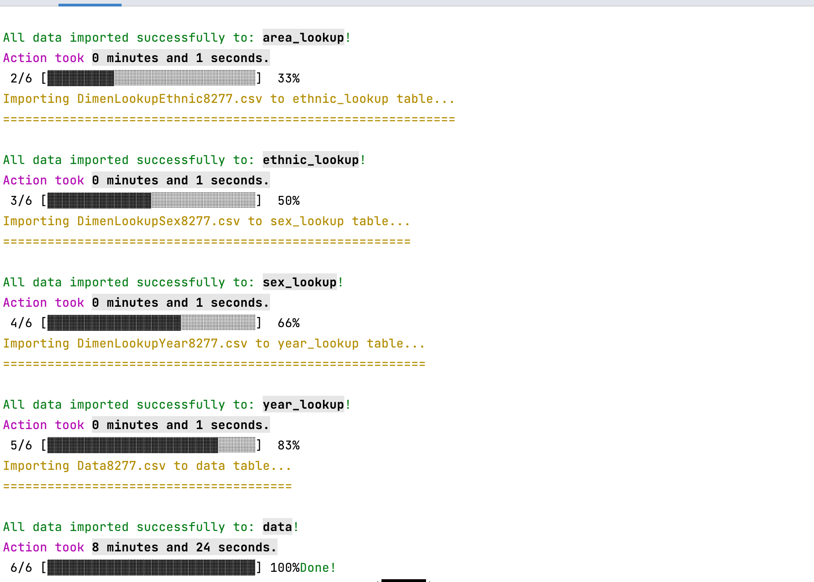
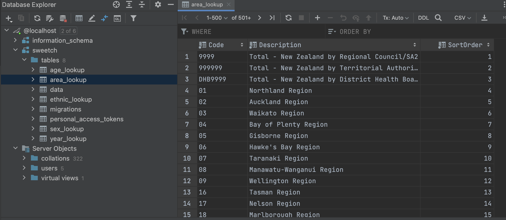
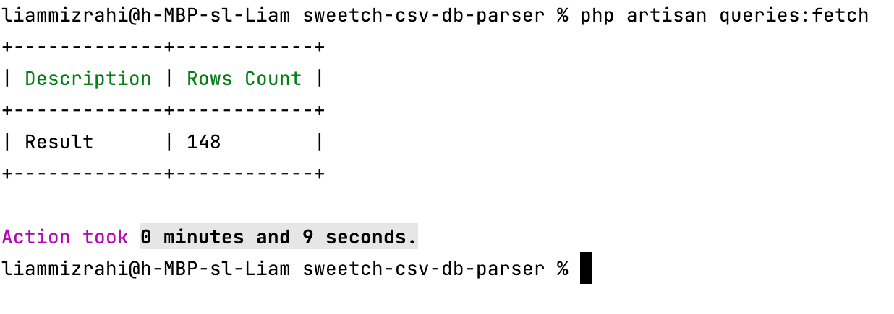

# CSV to database parser

This is the home task that turn the data CSV to a database table with Laravel

## Requirements

- PHP >= 8.1
- [Composer](https://getcomposer.org/) Installed
- MySQL Credentials

## Installation
You need to clone the repository to your local machine and run these commands:
```sh
cd sweetch-db-csv-parser
composer install
php artisan key:generate
```

If we want to actually make a database table, we need to put our MySQL credentials in the `.env` file.

```env
DB_CONNECTION=mysql
DB_HOST=127.0.0.1
DB_PORT=3306
DB_DATABASE=laravel
DB_USERNAME=root
DB_PASSWORD=
```
For this task I used MySQL, but you can use any other database that Laravel supports.


## Task
To access the task we will need to use the terminal laravel's artisan commands.

### Section 1: Database Scheme
To create the database table we will use Laravel's migration
The path of file in the repository: `database/2023_02_16_223044_create_data_table.php`

To actually create the table we will have to run this command in the terminal:
```sh
php artisan migrate
```


It will create our table with the following scheme:


### Section 2: Convert the CSV to rows in the db
Unfortunately GitHub allowes files up to 100MB so I couldn't upload it to the git,
so we need to add the CSV files to the path like this: `storage/app/Data8277.csv`
The implementation for this logic located in `app/Console/Commands/ImportData.php`

To run the command:
```sh
php artisan import:data
```



We will see that out data will be imported to the database table



The action will read the command line by line and the data will be imported in batches of 1000 rows, so it will be faster, but not run out of memory.
### Section 3: Queries
It was a bit unclear in the documentation which queries should I provide so I decided to implement both.
The implementation for this logic located in `app/Console/Commands/FetchQueries.php`

To run the command:
```sh
php artisan queries:fetch
```
It should output a table in the terminal with the desired data


